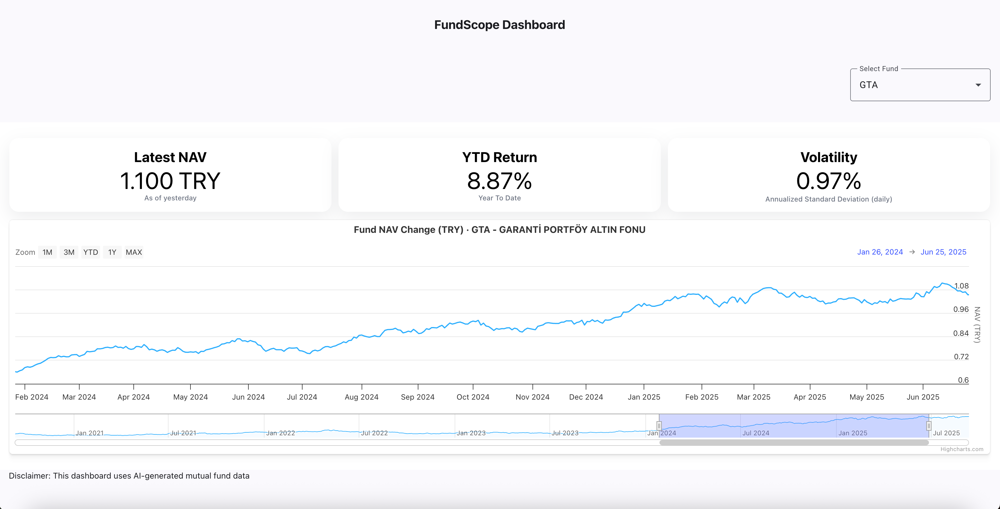
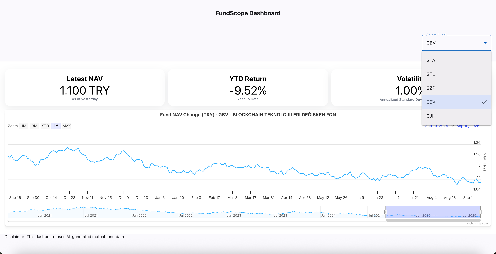
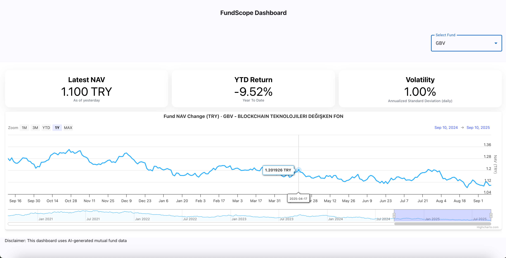

# FundScope — Mutual Fund KPI & Performance Dashboard

A minimal Angular application that visualizes **mutual fund KPIs and performance**.  
I developed this to attain working knowledge of Highcharts & Highcharts Dashboard - this can potentially turn into a viable fund comparison tool in the future.
FundScope currently uses **mock data** for five Turkish mutual funds:

**GTA · GTL · GZP · GBV · GJH**

**Live Demo with Github Pages:** https://usama129.github.io/fundscope/

---

## Overview

FundScope provides a fast, single-page dashboard to explore fund performance at a glance. It includes:

- **Key KPIs** (e.g., latest NAV, YTD return, volatility)
- **An interactive chart** for historical NAV and returns
- **Fund switcher** to compare across multiple funds
- **Responsive UI** designed for quick scanning and presentation

> ⚠️ **Data:** The app uses **mock datasets** while a feasible realtime data source is being finalized.

---

## Screenshots

 

 

---

## Tech Stack

- **Angular** (with Angular CLI)
- **Highcharts / Highcharts Dashboards** for charts & KPIs
- **Angular Material** for structure and UI elements other than Highcharts

---

This project was generated using [Angular CLI](https://github.com/angular/angular-cli) version 20.2.1.

## Development server

To start a local development server, run:

```bash
ng serve
```

Once the server is running, open your browser and navigate to `http://localhost:4200/`. The application will automatically reload whenever you modify any of the source files.

## Code scaffolding

Angular CLI includes powerful code scaffolding tools. To generate a new component, run:

```bash
ng generate component component-name
```

For a complete list of available schematics (such as `components`, `directives`, or `pipes`), run:

```bash
ng generate --help
```

## Building

To build the project run:

```bash
ng build
```

This will compile your project and store the build artifacts in the `dist/` directory. By default, the production build optimizes your application for performance and speed.

Angular CLI does not come with an end-to-end testing framework by default. You can choose one that suits your needs.

## Additional Resources

For more information on using the Angular CLI, including detailed command references, visit the [Angular CLI Overview and Command Reference](https://angular.dev/tools/cli) page.
